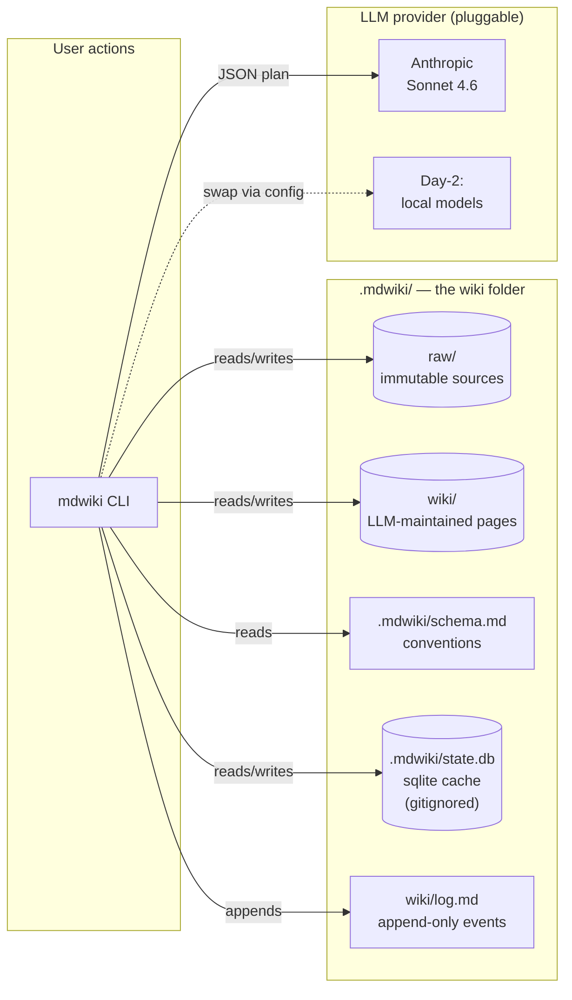
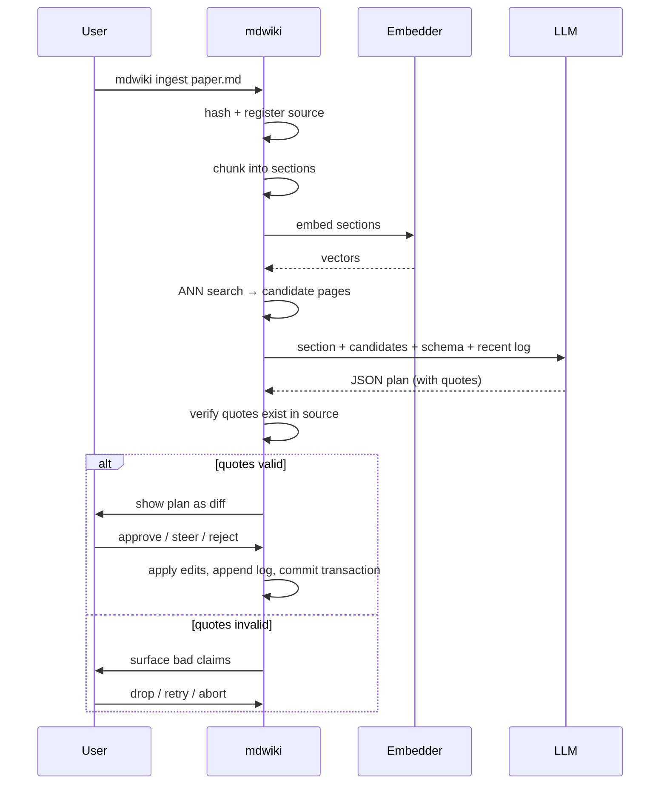

# mdwiki — v1.0.0 Design

**Vision.** A folder-local CLI that turns any directory of markdown into an LLM-maintained wiki: immutable raw sources, an LLM-owned wiki layer of interlinked pages, and a schema document the user controls. Built on Karpathy's *llm-wiki* pattern. Replaces `markdown-consolidator`; the existing modules become internals.

This document is the locked v1.0.0 contract. All open questions from v0 are resolved below.

## Current implementation note — provider-aware bootstrap

The historical sections below describe the v1.0 contract and v1.1 Anthropic Batch API addition. Current mdwiki keeps the config-driven provider as the single source of truth for every ingest path:

- `Provider.supports_batch` and `Provider.supports_tool_use` declare backend capabilities; built-in provider bootstrap routing follows those capabilities instead of choosing a vendor by name.
- `init/refresh --bootstrap-batch` uses native batch only when the configured provider declares it. Otherwise mdwiki announces a synchronous fallback and calls that same provider once per outstanding source.
- Unsupported batch never causes an implicit switch to Anthropic.
- Each source is applied in its own `IngestTransaction`. Source-local failures are persisted as `failed` with a reason in both `state.db` and `raw/.sources.json`; `mdwiki status` enumerates them.
- `ingest --pending` and both bootstrap paths select `pending` plus `failed`, so reruns target only unfinished sources.

## UX (the happy path)

```bash
$ cd ~/notes/research        # a folder with hundreds of .md scattered in subdirs
$ mdwiki init                # scaffolds .mdwiki/, registers sources, ingests nothing
$ mdwiki status              # 412 pending sources, 0 wiki pages
$ mdwiki ingest --all        # incremental loop; logs every page touched
$ mdwiki query "what did I conclude about transformer attention sinks?"
$ mdwiki lint                # contradictions, orphans, stale pages, header quality
$ mdwiki undo                # roll back the last ingest transaction
```

Every command discovers the wiki by walking up for `.mdwiki/` (like `git`). The folder *is* the wiki — config, sqlite cache, schema, raw, and wiki/ all live inside it.

## Architecture at a glance



## Directory layout

```
my-wiki/
  .mdwiki/
    config.toml          # provider, model, thresholds, exclude globs
    state.db             # sqlite cache: sources, pages, backrefs, events, embeddings
    schema.md            # standalone schema (NOT symlinked — see "Schema layer")
  raw/                   # immutable, append-only, content-addressed (flat)
  wiki/
    index.md             # LLM-maintained catalog by category
    log.md               # append-only event log (mirrors state.db events)
    entities/            # one page per entity
    concepts/            # one page per concept
    syntheses/           # cross-cutting writeups
```

`raw/` is **flat with content-addressed names** (`raw/<sha256[:12]>-<slug>.md`). Original folder paths live in `state.db` as `original_path` AND in `raw/.sources.json` (a small JSON sidecar mapping `<short_hash> → {original_path, mtime}`). The sidecar is what makes `mdwiki rebuild` truly source-of-truth-preserving: with `state.db` deleted, the sidecar plus the raw files are enough to reconstruct everything. The sidecar surfaces to the LLM as a *hint* during ingest, not as a constraint. Rationale:

- The wiki layer is the only place "structure" should live, and the LLM owns it.
- Flattening avoids two competing taxonomies (filesystem vs wiki).
- Provenance survives without coupling.
- `mdwiki source <id>` resurfaces original path on demand.

No `--auto-sort` of raw — there is nothing to sort. Auto-organization happens in `wiki/` and is the LLM's job. (`--mirror-raw` stays as an escape hatch.)

## Schema layer (`.mdwiki/schema.md`)

A user-editable markdown file defining: page kinds (`entity`, `concept`, `synthesis`), naming/linking conventions, when to create vs update a page, citation format, lint policies. Ships with a sane default.

**Separation of concerns.** mdwiki does NOT touch your `CLAUDE.md`. The schema is its own file, owned by mdwiki, scoped to wiki conventions only. If you want Claude Code instances opening this folder to auto-load the schema, add this line to your `CLAUDE.md` manually:

```markdown
@.mdwiki/schema.md
```

mdwiki will never write to `CLAUDE.md` and will never assume one exists.

## Initialize behavior

`mdwiki init` is **non-destructive and idempotent**:

1. Create `.mdwiki/` with default config, empty sqlite schema, and a starter `schema.md`.
2. Walk the folder (respecting `.gitignore` + config excludes) and **register** every loadable source as `pending`: hash, mtime, original_path, converted/copied to `raw/`.
3. Refuse to init if a parent already contains `.mdwiki/` — single wiki per folder, like git. (No nested wikis. Use separate folders for separate wikis.)
4. Print a summary; **ingest nothing**.

Then the user picks how to bootstrap:

| Mode | Command | When to use |
|---|---|---|
| Incremental | `mdwiki ingest <file>` or `--pending` | Default; one source at a time, or only outstanding pending/failed sources |
| Synchronous bootstrap | `mdwiki init --bootstrap` | Cold start through the configured provider, one independently committed source at a time |
| Batch-preferred bootstrap | `mdwiki init --bootstrap-batch` | Use configured-provider native batch when supported; otherwise announce and use same-provider synchronous ingest |
| Lazy | (do nothing) | Sources stay `pending`; only ingested when referenced by a query |

Bootstrap is where today's `clustering` + `synthesis` modules earn their keep — they solve the cold-start problem the wiki pattern is weakest at.

## Ingest algorithm (one source)

Ingest is **interactive by default**. The LLM proposes a plan; the user reviews, steers, approves; mdwiki writes. A `--yes` flag skips the confirmation for power users.



Step by step:

1. Hash + register; copy to `raw/` if new.
2. Chunk (`chunker.py`); embed each section (`embedder.py`).
3. ANN search over `pages.embedding` for the union of section embeddings → candidate pages (top-k).
4. **One LLM call per source** with: all sections + candidate pages + `schema.md` + recent log entries → JSON plan of `{verdict, rationale, updates, new_pages, cross_refs}`. Each claim carries `source_section_id` and a verbatim `quote`. (One call per source — not per section — keeps cost and UX friction low; if quality suffers on long sources, decompose in a later release.)
5. **Verify** every quote exists in the source text (pure Python, no LLM call). On failure, surface to the user.
6. Show the plan as a diff. User approves, steers (e.g., "drop the new page, just update X"), or aborts.
7. Apply edits to `wiki/`; append to `log.md`; insert `events` + `backrefs` rows in `state.db`; mark source `ingested`. All within a single sqlite transaction.

Periodically run `mdwiki lint` (or `--lint-after`) to catch drift.

## The LLM call

### Provider

v1.0.0 ships with one provider: **Anthropic Claude Sonnet 4.6**. Selected via `config.toml`:

```toml
[llm]
provider = "anthropic"
model = "claude-sonnet-4-6"
```

### Sync vs batch

- **Sync** (`messages.create`): used for `mdwiki ingest <file>`, `mdwiki query`, `mdwiki lint`. Real-time, full price. Prompt caching enabled on `schema.md` and recent log to keep input cost low.
- **Batch** (`messages.batches`): used for `mdwiki init --bootstrap`. 50% cost reduction, ~1h typical turnaround (24h max). Bootstrap has no latency requirement, so the savings are free.

### Hallucination guards (anti-sycophancy)

The ingest LLM gets explicit license to refuse, push back, and produce empty plans. The system prompt makes this load-bearing:

```
You are a wiki maintainer. Your job is to weave a new source into an existing
wiki WITHOUT producing slop.

Be skeptical. Most sources do NOT deserve major changes. Empty plans are valid
and often the correct output. Do NOT pad your response to look productive.

Refuse to:
- Write speculative content not present in the source
- Create a new page when an existing page already covers the topic
- Expand a page just because there's room — only add what is load-bearing
- Adopt the source's framing if it conflicts with the schema or existing pages
- Be agreeable when the user's framing is wrong; say so

Every claim in your plan MUST include:
- source_section_id: the chunk this claim comes from
- quote: a 5–15 word verbatim excerpt from the source supporting the claim
  mdwiki greps the source for this quote. Missing quotes INVALIDATE the entire plan.

Output schema:
{
  "verdict": "ingest" | "duplicate-of:<page_path>" | "low-quality" | "out-of-scope",
  "rationale": "<one sentence>",
  "updates":     [{ "page": "...", "content": "<COMPLETE revised page body>", "claims": [{ "source_section_id": "...", "quote": "..." }] }],
  "new_pages":   [{ "path": "...", "kind": "entity|concept|synthesis", "content": "...", "claims": [...] }],
  "cross_refs":  [{ "from_page": "...", "to_page": "...", "anchor_text": "..." }]
}

For an UPDATE, ``content`` is the COMPLETE revised page body — mdwiki replaces the entire file with this text. The LLM is responsible for preserving everything it doesn't intend to change. v1.0.0 deliberately skips section-aware splicing (simpler, more reliable, avoids markdown-AST work).

If verdict is anything other than "ingest", updates/new_pages/cross_refs MUST be empty.
```

Verification stack (cheapest → most expensive):

1. **Schema-validated JSON.** Invalid JSON → retry once.
2. **Cite-or-refuse.** Every claim must reference a real `source_section_id`.
3. **Quote-anchor.** Every claim's `quote` must appear verbatim (whitespace-normalized) in the source. mdwiki implements this in pure Python.
4. **Human-in-the-loop.** The user is the final critic, by design (interactive ingest).

We deliberately skip a self-critique LLM pass (would double cost). The human is the second pass.

### Provider seam (Day-2 local models)

```
src/mdwiki/llm/
  base.py        # Provider abstract base class
  anthropic.py   # v1.0.0
  openai_compatible.py  # v1.1+ (vLLM, llama.cpp, OpenRouter, Together, etc.)
  __init__.py    # factory: read [llm] config → return provider instance
```

The `Provider` interface:

```python
class Provider(ABC):
    supports_batch: bool = False
    supports_tool_use: bool = False

    @abstractmethod
    def complete(self, *, system: str, messages: list[Message], max_tokens: int = 1024) -> CompleteResult: ...

    def batch_complete(self, requests: list[BatchRequest], ...) -> list[BatchResult]: ...
    def estimate_batch_cost(self, requests: list[BatchRequest]) -> BatchCostEstimate: ...
    def is_recoverable_error(self, exc: Exception) -> bool: ...
```

The provider seam was the v1.0.0 commitment. v1.1 added the generic OpenAI-compatible adapter; later orchestration made optional capabilities explicit so providers without native batch support can use the same safe synchronous ingest workflow.

## Wiki edit safety

**Direct write + transactional `mdwiki undo`.**

Every ingest is a sqlite transaction. The transaction commits all of:

- File writes to `wiki/`
- New rows in `events`, `backrefs`
- Updated rows in `sources`, `pages`
- One appended line in `log.md`

`mdwiki undo [N]` (default N=1) reverses the last N transactions:

- File writes get rolled back from a per-transaction snapshot stored in `.mdwiki/undo/<transaction_id>/`.
- DB rows get reverted via stored inverse statements.
- The `log.md` line gets a strikethrough marker rather than deletion (immutable history; the user can always see what was undone).

Undo retention defaults to last 50 transactions. Configurable in `config.toml`.

This is faster than a staged `pending-edits/` workflow and gives a real escape hatch beyond `git`. `git` works too, but `mdwiki undo` understands the `state.db` rows that need rolling back.

## Conflict UX

Because ingest is interactive, conflict resolution happens in the conversation. Three concrete scenarios:

| Scenario | Default behavior |
|---|---|
| LLM proposes editing a wiki page the user just hand-edited | Show both versions side-by-side, user picks (theirs / LLM's / merge / skip) |
| LLM proposes a new page at a path that already exists | Show as an update to the existing page, not a new page; user can split off if intended |
| Quote verification fails on N claims | List the bad claims; user picks (drop those claims and apply the rest / retry whole plan / abort) |

`--yes` skips all prompts and applies the LLM's plan verbatim if quote verification passes. If verification fails with `--yes`, the ingest aborts (never silent failure).

## State schema (sqlite)

`.mdwiki/state.db` is a **local cache, gitignored**. The source of truth is `raw/` (including `raw/.sources.json`) + `wiki/` + `wiki/log.md`. `mdwiki rebuild` reconstructs the cache from those.

Tables:

- `sources(id, original_path, raw_path, content_hash, mtime, ingested_at, status)`
- `pages(path, kind, embedding BLOB, last_touched_at)`
- `backrefs(page_path, source_id, section_anchor, quote, confidence)`
- `events(ts, kind, source_id, page_paths_json, summary, transaction_id)` — mirrors `log.md`
- `embeddings(text_hash, vector BLOB)` — embedding cache (most expensive thing to rebuild; also cacheable separately if needed)
- `transactions(id, ts, undo_snapshot_path, applied)` — for undo
- `transaction_inverses(transaction_id, sql)` — for undo DB rollback

Default `.gitignore` for the wiki folder:

```
.mdwiki/state.db
.mdwiki/state.db-journal
.mdwiki/undo/
```

## Multi-wiki policy

**Single wiki per folder, like git.** No nested wikis. `mdwiki init` walks up first; if a parent has `.mdwiki/`, init refuses with a clear error.

If you want separate wikis for separate projects, keep them in separate folders. The cost of "scoped wikis inside a parent wiki" is constant ambiguity about where new sources belong.

## Cost model

Calibrated against the v1.0.0 test corpus: `~/Desktop/Clippings`, 101 markdown files, 2.6 MB.

| Operation | Estimate (Sonnet 4.6 with prompt caching) |
|---|---|
| `init` (no LLM calls — just registers) | $0 |
| `init --bootstrap-batch` (101 files via Anthropic Batch API) | **$5–15** |
| `ingest <file>` (one new source, sync) | **$0.05–$0.20** depending on size |
| `query "..."` (one question, sync) | **$0.01–$0.05** |
| `lint` (full pass, sync) | **$0.50–$2** |
| `rebuild` (no LLM calls — embeddings recomputed locally if not cached) | $0 (embeddings are local via sentence-transformers) |

These numbers will get re-validated by the implementation; bootstrap especially is sensitive to chunk count.

## Test approach

v1.0.0 development uses two corpora:

| Corpus | Path | Purpose |
|---|---|---|
| Real | `~/Desktop/Clippings` (101 files, copied + expendable) | End-to-end manual testing throughout |
| Synthetic seed | Generated under `tests/fixtures/wiki-corpus/` | Deterministic unit/integration tests |

Each implementation phase ends in a manual-testing gate where the user runs concrete commands against `~/Desktop/Clippings` and confirms behavior before the next phase begins. The plan document enumerates each gate.

## Command surface

| Command | Purpose |
|---|---|
| `mdwiki init [--bootstrap\|--bootstrap-batch]` | Scaffold, register sources, and optionally ingest through the configured provider |
| `mdwiki refresh [--bootstrap\|--bootstrap-batch]` | Register new sources and optionally ingest outstanding pending/failed sources |
| `mdwiki ingest [<file>\|--all\|--pending] [--yes]` | Incremental ingest; `--pending` includes retryable failures |
| `mdwiki query "<q>" [--file]` | Search + synthesize, optionally file findings as a new page |
| `mdwiki lint [--fix]` | Contradictions, orphans, stale, focus, headers, gaps |
| `mdwiki status` | Pending/failed/ingested counts, failed-source reasons, last lint, recent events |
| `mdwiki source <id>` | Reveal raw path / original path / dependent pages |
| `mdwiki undo [N]` | Roll back the last N ingest transactions |
| `mdwiki rebuild` | Reconstruct `state.db` from `raw/` + `wiki/` + `log.md` |

## Migration stance

Drop `mdconsolidate` as a public CLI. The existing modules become **internals of `mdwiki`**, called by `init --bootstrap`, `ingest`, and `lint`:

- `inventory` → used by `init` for source discovery
- `chunker` → used by `ingest` for sectioning
- `embedder` → used by `ingest`, `query`, and `init --bootstrap`
- `clustering` + `synthesis` → used by `init --bootstrap` for cold-start seeding
- `summarizer` → used by `ingest` for page-update phrasing
- `tree_builder`, `keywords`, `relationships` → used by `lint` and `query`
- `encapsulation` → used by `lint`
- `header_coherence`, `outline_consolidator` (in flight) → used by `lint`

No backwards-compat shims, no parallel front-end. Project rename: `markdown-consolidator` → `mdwiki`. Version: ship as **v1.0.0** under the new name; old package gets a final v0.3.0 release noting the rename.

## v1.0.0 non-goals

Explicitly **not** in v1.0.0 (designed for, but deferred):

- **Local model providers** (Qwen, Kimi, etc.) — provider seam exists, implementations are Day 2
- **Multi-filetype ingest** — v1.0.0 reads `.md` only. v1.1.0 adds a `Loader` abstraction with concrete loaders for txt / csv / pdf / docx / html / code / images (vision OCR). The ingest pipeline below stays the same once content is markdown-text; only the front of the pipe changes
- **Batch API for `init --bootstrap`** — v1.0.0 `init --bootstrap` chains init + sync ingest. v1.1.0 adds Anthropic Batch API submission for ~50% cost reduction at the price of ~1h turnaround. The R1 ANN-candidates path already gives the LLM context to update existing pages, which was the structural cold-start problem; batching is now a pure cost optimization, not a correctness one
- **Web UI / GUI** — CLI only
- **Multi-user / collaboration** — single-user
- **Real-time wiki preview** — no live render
- **Export to other formats** (HTML, PDF) — markdown only
- **Cross-machine `state.db` sync** — use `rebuild` after clone
- **Scheduled background ingest** — manual invocation only
